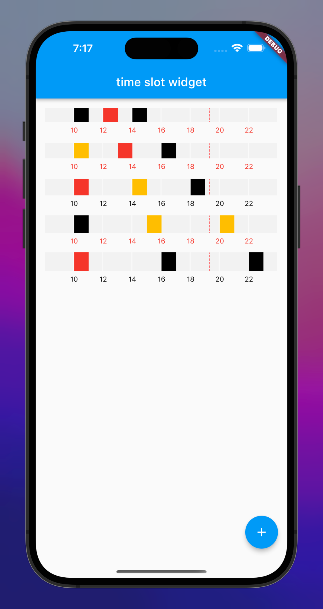

<!--
This README describes the package. If you publish this package to pub.dev,
this README's contents appear on the landing page for your package.

For information about how to write a good package README, see the guide for
[writing package pages](https://dart.dev/guides/libraries/writing-package-pages).

For general information about developing packages, see the Dart guide for
[creating packages](https://dart.dev/guides/libraries/create-library-packages)
and the Flutter guide for
[developing packages and plugins](https://flutter.dev/developing-packages).
-->.

# 时间轴的widget


## Features

用于预约会议室时间段显示

## Getting started

```dart
dependencies:
  flutter:
    sdk: flutter
  time_slot_widget: 0.1.0
```

## Usage

```dart
TimeSlotWidget(
  timeItemBuilder: (int index) {
    int start = 10 + index * max(2, indexFirst + 2);
    int end = start + 1;
    return TimeItemEntity(
      start: buildDateTime(start),
       end: buildDateTime(end),
    );
  },
  count: 3,
  timeStyle: TimeStyle(
    height: (50 + indexFirst).toDouble(),
    timeHeight: (24 + indexFirst*2).toDouble(),
  ),
);

```

## Additional information


